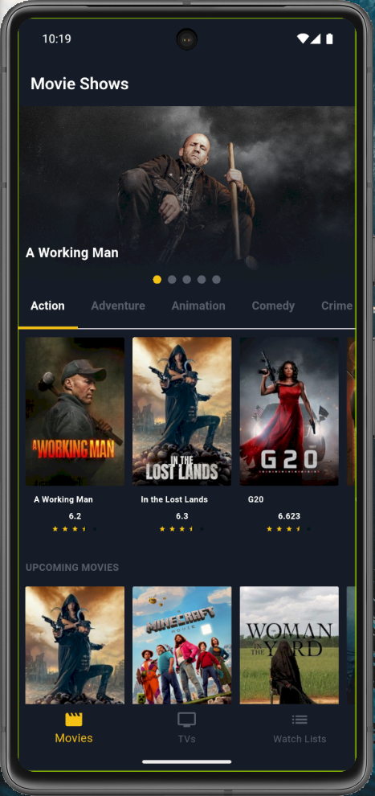
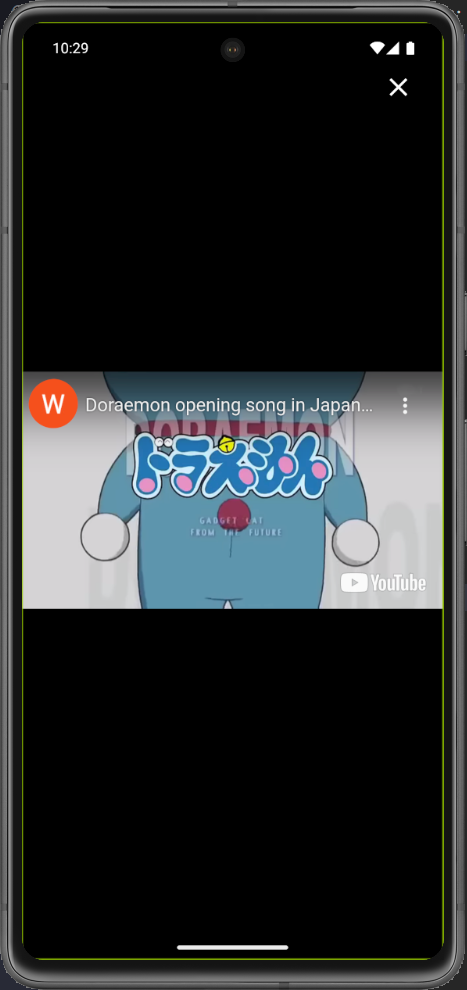
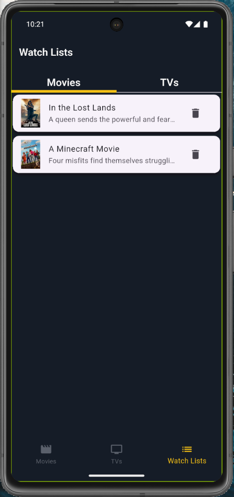

# 🎬 Movie App Flutter

Aplikasi Movie App sederhana berbasis **Flutter**, menggunakan API, local storage dengan Hive, dan fitur multimedia seperti pemutaran trailer dari YouTube. Dirancang untuk menampilkan daftar film dan detailnya secara interaktif.

---

## 📱 Tampilan Aplikasi

| Home Screen | Movie Detail | YouTube Trailer | Watch List |
|-------------|---------------|------------------|------------|
|  |  |  |  |

---

## 🚀 Fitur Utama

- 📽️ Lihat detail lengkap film
- ⭐ Simpan film favorit ke local storage
- ▶️ Putar trailer film via YouTube Player
- 📦 Data tersimpan dengan Hive (offline ready)
- 🎞️ Tampilan carousel dengan indikator halaman

> ⚠️ **Fitur dark mode dan search belum tersedia.** Akan ditambahkan di versi berikutnya.

---

## 🧰 Package yang Digunakan

| Package | Fungsi |
|--------|--------|
| [`dio`](https://pub.dev/packages/dio) | HTTP client powerful untuk mengambil data dari API |
| [`youtube_player_flutter`](https://pub.dev/packages/youtube_player_flutter) | Menampilkan video trailer langsung dari YouTube |
| [`flutter_rating_bar`](https://pub.dev/packages/flutter_rating_bar) | Menampilkan rating film dengan bintang |
| [`page_indicator`](https://pub.dev/packages/page_indicator) | Menampilkan indikator halaman pada carousel |
| [`flutter_dotenv`](https://pub.dev/packages/flutter_dotenv) | Mengelola variabel lingkungan (API key, dll) |
| [`hive`](https://pub.dev/packages/hive) | Menyimpan data lokal (seperti film favorit) |
| [`hive_flutter`](https://pub.dev/packages/hive_flutter) | Integrasi Hive dengan Flutter |
| [`hive_generator`](https://pub.dev/packages/hive_generator) | Generate adapter dari model Hive |
| [`build_runner`](https://pub.dev/packages/build_runner) | Digunakan untuk generate file Hive adapter |

---

## ⚙️ Cara Menjalankan

1. **Clone project**
   ```bash
   git clone https://github.com/username/movie_app_flutter.git
   cd movie_app_flutter

2. **Create file .env**

        API_KEY=your_api_key_here

3. **Run The Project**

        flutter clean
        flutter pub get
        flutter run
